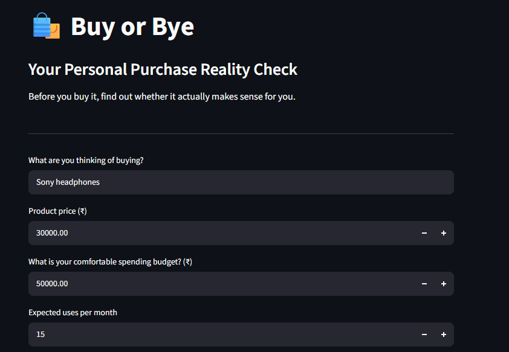
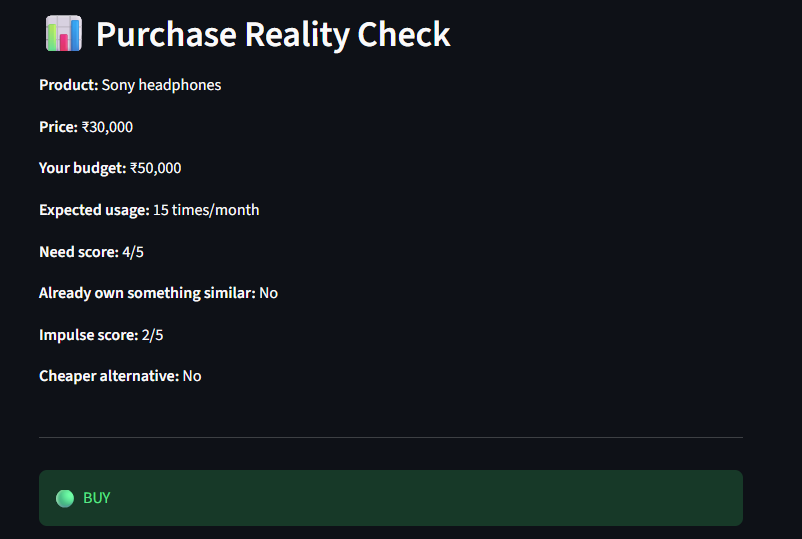
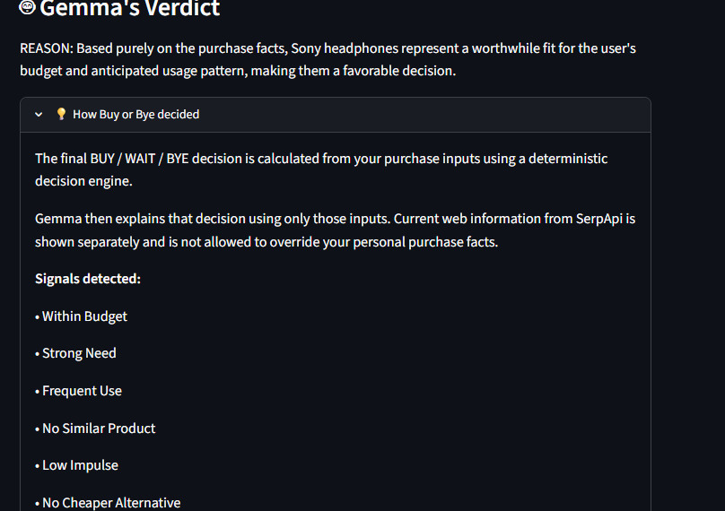

# 🛍️ Buy or Bye

### Your Personal Purchase Reality Check

**Before you buy it, find out whether it actually makes sense for you.**

Buy or Bye is a simple AI-powered purchase decision assistant that helps users think beyond generic product reviews. Instead of only asking whether a product is good, it considers the user's own budget, expected usage, need, impulse level, existing similar products, and cheaper alternatives to provide a simple **BUY, WAIT, or BYE** recommendation.

---

## 🎥 Demo

**Demo video:** `PASTE_YOUR_DEMO_LINK_HERE`

The demo shows the application taking a real purchase scenario, retrieving current web information, calculating a purchase verdict, and using Gemma to explain the result.

---

## 💡 The Problem

Online shopping platforms provide plenty of product information and reviews, but they usually do not answer a more personal question:

> **"Does buying this product actually make sense for me?"**

A product can be highly rated and still be a poor purchase for an individual because:

- It may be outside their comfortable budget.
- They may not use it often enough.
- They may not actually need it.
- They may already own something similar.
- They may be buying impulsively.
- A cheaper alternative may already meet their needs.

Buy or Bye focuses on this **personal purchase decision** rather than simply recommending products.

---

## 🚀 The Solution

Buy or Bye asks the user for a few simple purchase-related details and evaluates them using a deterministic Python decision engine.

The application returns one of three outcomes:

- 🟢 **BUY** — The purchase factors generally support buying.
- 🟡 **WAIT** — Some factors suggest pausing and reconsidering.
- 🔴 **BYE** — The purchase factors strongly suggest avoiding the purchase.

The result is then explained in natural language using **Gemma 3:1b** running locally through **Ollama**.

---

## 🧠 How It Works

```text
                 User Purchase Details
                          │
                          ▼
                Python Decision Engine
                          │
                          ▼
                   BUY / WAIT / BYE
                          │
                          ▼
                   Gemma 3:1b
                Explanation Layer
                          ▲
                          │
                    SerpApi Search
                Current Web Information
```

The application deliberately separates the responsibilities of each component:

### Python Decision Engine
Python handles the objective purchase logic using the information provided by the user.

It considers factors such as:

- Price compared with budget
- Need score
- Expected monthly usage
- Existing similar product
- Impulse score
- Cheaper alternative

### Gemma 3:1b
Gemma is used as the **explanation layer**.

The Python decision engine determines the verdict first. Gemma then explains why that predetermined verdict makes sense using the actual purchase facts.

This prevents the language model from being responsible for basic arithmetic or changing the application's decision.

### SerpApi
SerpApi provides **current web information** related to the product, such as search results, product discussions, reviews, and alternatives.

The web information is displayed separately from the deterministic purchase decision so that current search results do not override the user's actual purchase facts.

---

## 📝 What the User Provides

Buy or Bye uses eight simple inputs:

| Input | Purpose |
|---|---|
| Product | What the user is considering buying |
| Price | Current price of the product |
| Budget | User's comfortable spending limit |
| Expected usage | How many times the user expects to use it per month |
| Need score | How necessary the purchase feels, from 1–5 |
| Similar product | Whether the user already owns something similar |
| Impulse score | How impulsive the purchase feels, from 1–5 |
| Cheaper alternative | Whether a cheaper alternative can meet the user's needs |

---

## ⚙️ Decision Logic

The application uses deterministic rules to produce the final verdict.

Some examples:

- A product priced above the user's budget can result in **BYE**.
- Low need combined with high impulse can result in **BYE**.
- Already owning a similar product with a low/moderate need can result in **BYE**.
- A cheaper alternative can result in **WAIT**.
- High impulse can result in **WAIT**.
- Moderate need or very low expected usage can result in **WAIT**.
- Otherwise, the purchase can result in **BUY**.

The exact verdict is calculated by Python before Gemma is called.

---

## 🤖 Why Gemma?

Gemma is used because the project needs a local open-source language model to turn structured decision signals into a concise, human-readable explanation.

Instead of asking the model to make the entire purchase decision, Buy or Bye gives Gemma the already-calculated verdict and the relevant purchase facts.

This creates a clear division:

**Python decides. Gemma explains.**

Gemma 3:1b is run locally through Ollama, keeping the explanation layer lightweight and locally executable.

---

## 🔎 Why SerpApi?

Purchase decisions can benefit from information that changes over time.

SerpApi allows Buy or Bye to retrieve current web search information related to the product being considered.

This gives the user two different perspectives:

**Personal decision factors** → handled by the Python decision engine

**Current web context** → provided by SerpApi

The search results do not override the deterministic verdict.

---

## 🛠️ Technology Stack

- **Python** — Core application and decision logic
- **Streamlit** — Interactive web interface
- **Gemma 3:1b** — AI explanation layer
- **Ollama** — Local execution of Gemma
- **SerpApi** — Current web search information
- **python-dotenv** — Environment variable management

---

## 📸 Screenshots

### Main Interface



### Purchase Reality Check



### Current Web Information


### Gemma's Verdict



---

## 🧪 Example

Consider a user thinking about buying headphones:

```text
Product: Sony headphones
Price: ₹30,000
Budget: ₹50,000
Expected usage: 15 times/month
Need: 4/5
Similar product: No
Impulse: 2/5
Cheaper alternative: No
```

The Python decision engine determines:

```text
BUY
```

Gemma then explains the decision based only on the provided purchase facts and calculated signals.

Changing the purchase conditions can produce a different result such as **WAIT** or **BYE**.

---

## 📂 Project Structure

```text
buy-or-bye/
│
├── app.py
├── requirements.txt
├── README.md
├── LICENSE
├── .gitignore
└── .env
```

> `.env` is used locally for the SerpApi API key and must not be committed to GitHub.

---

## 💻 Run Locally

### 1. Clone the repository

```bash
git clone YOUR_GITHUB_REPOSITORY_URL
cd buy-or-bye
```

### 2. Create and activate a virtual environment

```bash
python -m venv .venv
```

On Windows:

```bash
.venv\Scripts\activate
```

### 3. Install dependencies

```bash
pip install -r requirements.txt
```

### 4. Install and run Ollama

Install Ollama and make sure it is running locally.

Pull the Gemma model:

```bash
ollama pull gemma3:1b
```

### 5. Configure SerpApi

Create a `.env` file in the project directory:

```text
SERPAPI_KEY=your_serpapi_key
```

Do not share or commit your API key.

### 6. Start the application

```bash
streamlit run app.py
```

The application will open in your browser.

---

##  Environment Variables

The application expects:

```text
SERPAPI_KEY
```

Keep your `.env` file private.

The repository's `.gitignore` should contain:

```text
.env
.venv/
__pycache__/
```

---

##  Future Improvements

Possible future improvements include:

- More advanced product and price comparison
- More personalized purchase rules
- Purchase history and spending insights
- Optional voice-based verdicts
- Additional product research sources

These are intentionally outside the current scope to keep the application simple and focused.

---

## 🎯 Built For

**Hacktoberfest 2026 — DEV Weekend Challenge**

**Theme:** Build for a Friend

**Challenge:** Build something with open-source AI at its core.

Buy or Bye was designed as a practical tool for anyone who wants to pause before making an online purchase and ask:

> **"Should I really buy this?"**

---

## 📄 License

This project is licensed under the MIT License. See the `LICENSE` file for details.
